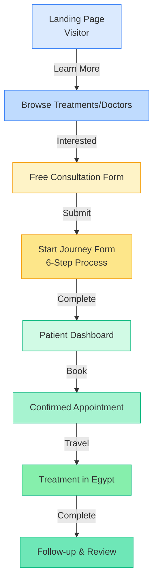

# Care N Tour - Website Flow Diagram

## Main User Journey Flow

```mermaid
flowchart TD
    Start([Website Visitor]) --> Home[Home Page]

    %% Main Navigation Flow
    Home --> About[About Us]
    Home --> Treatments[Treatments]
    Home --> Doctors[Our Doctors]
    Home --> Stories[Patient Stories]
    Home --> Blog[Blog]
    Home --> Plan[Plan Your Trip]
    Home --> TravelInfo[Travel Info]
    Home --> Concierge[Concierge Services]
    Home --> FAQ[FAQ]
    Home --> Contact[Contact]

    %% Treatment Flow
    Treatments --> TreatmentCategory[Treatment Category Page]
    TreatmentCategory --> TreatmentDetails[Treatment Details]

    %% Doctor Flow
    Doctors --> DoctorProfile[Doctor Profile Page]

    %% Blog Flow
    Blog --> BlogPost[Blog Post]

    %% Key Conversion Paths
    Home -->|CTA Button| Consultation[Free Consultation Form]
    Treatments -->|Book Treatment| Consultation
    Doctors -->|Book Consultation| Consultation
    TreatmentDetails -->|Get Started| Consultation
    DoctorProfile -->|Book Appointment| Consultation

    %% Consultation to Journey
    Consultation -->|Submit Request| StartJourney[Start Journey<br/>Multi-Step Form]

    %% Journey Steps
    StartJourney --> Step1[Step 1: Basic Info]
    Step1 --> Step2[Step 2: Medical History]
    Step2 --> Step3[Step 3: Travel Preferences]
    Step3 --> Step4[Step 4: Documents Upload]
    Step4 --> Step5[Step 5: Cost Estimation]
    Step5 --> Step6[Step 6: Schedule Consultation]
    Step6 --> Dashboard[Patient Dashboard]

    %% Authentication Flow
    Home -->|Sign In| Auth[Authentication Page]
    Auth -->|Login Success - Patient| Dashboard
    Auth -->|Login Success - Admin| AdminDashboard[Admin Dashboard]

    %% Patient Dashboard
    Dashboard --> PatientProfile[Patient Profile]
    Dashboard --> Appointments[My Appointments]
    Dashboard --> Documents[My Documents]
    Dashboard --> MedicalRecords[Medical Records]

    %% Admin Flow
    AdminDashboard --> AdminPatients[Manage Patients]
    AdminDashboard --> AdminDoctors[Manage Doctors]
    AdminDashboard --> AdminTreatments[Manage Treatments]
    AdminDashboard --> AdminAppointments[Manage Appointments]
    AdminDashboard --> AdminConsultations[Manage Consultations]
    AdminDashboard --> AdminRequests[Manage Requests]
    AdminDashboard --> AdminHotels[Manage Hotels]
    AdminDashboard --> AdminProviders[Manage Service Providers]
    AdminDashboard --> AdminTestimonials[Manage Testimonials]

    %% CMS Flow
    AdminDashboard -->|Content Management| CMS[CMS Dashboard]
    CMS --> CMSPages[Manage Pages]
    CMS --> CMSNew[Create New Page]
    CMS --> CMSEdit[Edit Page]
    CMS --> CMSMedia[Media Library]
    CMS --> CMSPreview[Preview Page]

    CMSPages --> CMSEdit
    CMSNew --> PageBuilder[Page Builder<br/>Visual Editor]
    CMSEdit --> PageBuilder
    PageBuilder --> BlockInspector[Block Inspector<br/>Style Editor]

    %% Dynamic Pages
    CMS -.->|Publishes| DynamicPage[Dynamic CMS Page<br/>/[slug]]
    DynamicPage -.->|Renders| Home

    %% Styling
    classDef conversion fill:#10b981,stroke:#059669,color:#fff
    classDef admin fill:#3b82f6,stroke:#2563eb,color:#fff
    classDef cms fill:#8b5cf6,stroke:#7c3aed,color:#fff
    classDef patient fill:#f59e0b,stroke:#d97706,color:#fff
    classDef journey fill:#ec4899,stroke:#db2777,color:#fff

    class Consultation,StartJourney conversion
    class AdminDashboard,AdminPatients,AdminDoctors,AdminTreatments,AdminAppointments,AdminConsultations,AdminRequests,AdminHotels,AdminProviders,AdminTestimonials admin
    class CMS,CMSPages,CMSNew,CMSEdit,CMSMedia,CMSPreview,PageBuilder,BlockInspector,DynamicPage cms
    class Dashboard,PatientProfile,Appointments,Documents,MedicalRecords patient
    class Step1,Step2,Step3,Step4,Step5,Step6 journey
```

## Simplified User Personas Flow

```mermaid
flowchart LR
    subgraph Visitor Flow
        V1[Browse Website] --> V2[Learn About Treatments]
        V2 --> V3[View Doctors]
        V3 --> V4[Request Consultation]
    end

    subgraph Patient Flow
        P1[Submit Journey Form] --> P2[Upload Documents]
        P2 --> P3[Review Cost Estimate]
        P3 --> P4[Schedule Consultation]
        P4 --> P5[Access Dashboard]
        P5 --> P6[Track Treatment Progress]
    end

    subgraph Admin Flow
        A1[Admin Login] --> A2[Manage Patients]
        A2 --> A3[Manage Appointments]
        A3 --> A4[Manage Content CMS]
    end

    V4 -.->|Converts to| P1
    A4 -.->|Updates| V1

    classDef visitorStyle fill:#60a5fa,stroke:#3b82f6,color:#fff
    classDef patientStyle fill:#34d399,stroke:#10b981,color:#fff
    classDef adminStyle fill:#a78bfa,stroke:#8b5cf6,color:#fff

    class V1,V2,V3,V4 visitorStyle
    class P1,P2,P3,P4,P5,P6 patientStyle
    class A1,A2,A3,A4 adminStyle
```



## Page Architecture

```mermaid
graph TB
    Root[Root Layout<br/>Auth, Theme, Query Providers]

    Root --> Public[Public Pages]
    Root --> Protected[Protected Pages]
    Root --> AdminPages[Admin Pages]
    Root --> CMSPages[CMS Pages]

    Public --> Home[/]
    Public --> About[/about]
    Public --> Treatments[/treatments]
    Public --> Doctors[/doctors]
    Public --> Stories[/stories]
    Public --> Blog[/blog]
    Public --> Plan[/plan]
    Public --> TravelInfo[/travel-info]
    Public --> Concierge[/concierge]
    Public --> FAQ[/faq]
    Public --> Contact[/contact]
    Public --> Consultation[/consultation]
    Public --> Auth[/auth]

    Protected --> StartJourney[/start-journey<br/>Multi-Step Form]
    Protected --> Dashboard[/dashboard<br/>Patient Portal]
    Protected --> PatientDetail[/patients/[id]]

    AdminPages --> AdminRoot[/admin<br/>Admin Dashboard]
    AdminPages --> AdminPatients[/admin/patients]
    AdminPages --> AdminDoctors[/admin/doctors]
    AdminPages --> AdminTreatments[/admin/treatments]
    AdminPages --> AdminAppointments[/admin/appointments]
    AdminPages --> AdminConsultations[/admin/consultations]
    AdminPages --> AdminRequests[/admin/requests]
    AdminPages --> AdminHotels[/admin/hotels]
    AdminPages --> AdminProviders[/admin/service-providers]
    AdminPages --> AdminTestimonials[/admin/testimonials]

    CMSPages --> CMSRoot[/cms<br/>CMS Dashboard]
    CMSPages --> CMSNew[/cms/new]
    CMSPages --> CMSEdit[/cms/[slug]/edit]
    CMSPages --> CMSPreview[/cms/preview/[slug]]
    CMSPages --> CMSMedia[/cms/media]

    CMSPages -.->|Creates| DynamicPages[/[slug]<br/>Dynamic CMS Pages]

    classDef publicStyle fill:#93c5fd,stroke:#60a5fa,color:#000
    classDef protectedStyle fill:#fcd34d,stroke:#fbbf24,color:#000
    classDef adminStyle fill:#c4b5fd,stroke:#a78bfa,color:#000
    classDef cmsStyle fill:#ddd6fe,stroke:#c4b5fd,color:#000

    class Public,Home,About,Treatments,Doctors,Stories,Blog,Plan,TravelInfo,Concierge,FAQ,Contact,Consultation,Auth publicStyle
    class Protected,StartJourney,Dashboard,PatientDetail protectedStyle
    class AdminPages,AdminRoot,AdminPatients,AdminDoctors,AdminTreatments,AdminAppointments,AdminConsultations,AdminRequests,AdminHotels,AdminProviders,AdminTestimonials adminStyle
    class CMSPages,CMSRoot,CMSNew,CMSEdit,CMSPreview,CMSMedia,DynamicPages cmsStyle
```

## API Routes Structure

```mermaid
graph LR
    API[API Routes<br/>/api]

    API --> AdminAPI[/api/admin]
    API --> CMSAPI[/api/cms]
    API --> PublicAPI[Public APIs]

    AdminAPI --> Patients[/patients]
    AdminAPI --> Doctors[/doctors]
    AdminAPI --> Treatments[/treatments]
    AdminAPI --> Appointments[/appointments]
    AdminAPI --> Consultations[/consultations]
    AdminAPI --> Requests[/requests]
    AdminAPI --> Hotels[/hotels]
    AdminAPI --> Providers[/service-providers]
    AdminAPI --> Testimonials[/testimonials]

    CMSAPI --> Pages[/pages]
    CMSAPI --> Upload[/upload]

    PublicAPI --> ContactAPI[/contact]
    PublicAPI --> ConsultationsAPI[/consultations]
    PublicAPI --> PatientsAPI[/patients]
    PublicAPI --> Revalidate[/revalidate]

    classDef adminAPI fill:#818cf8,stroke:#6366f1,color:#fff
    classDef cmsAPI fill:#a78bfa,stroke:#8b5cf6,color:#fff
    classDef publicAPI fill:#34d399,stroke:#10b981,color:#fff

    class AdminAPI,Patients,Doctors,Treatments,Appointments,Consultations,Requests,Hotels,Providers,Testimonials adminAPI
    class CMSAPI,Pages,Upload cmsAPI
    class PublicAPI,ContactAPI,ConsultationsAPI,PatientsAPI,Revalidate publicAPI
```

## Conversion Funnel



## Key Features

### Public Features

- 🏠 Homepage with hero section and featured treatments
- 💉 Treatment catalog with categories
- 👨‍⚕️ Doctor profiles and specializations
- 📖 Patient success stories and testimonials
- 📝 Blog with medical tourism articles
- 🗺️ Travel information for Egypt
- 🛎️ Concierge services overview
- ❓ FAQ section
- 📞 Contact form

### Patient Journey Features

- 📋 Free consultation request form
- 🚀 Multi-step patient journey (6 steps):
  1. Basic Information
  2. Medical History
  3. Travel Preferences
  4. Document Upload
  5. Cost Estimation
  6. Schedule Consultation
- 📱 Patient dashboard for tracking
- 📄 Document management
- 📅 Appointment scheduling

### Admin Features

- 👥 Patient management
- 👨‍⚕️ Doctor management
- 💊 Treatment management
- 📅 Appointment management
- 📋 Consultation request management
- 🏨 Hotel management
- 🏥 Service provider management
- ⭐ Testimonial management

### CMS Features

- 📄 Page management
- ✏️ Visual page builder with drag-drop blocks
- 🎨 Block inspector for styling
- 🖼️ Media library
- 👁️ Live preview
- 📱 Responsive editing
- 🌐 SEO management
- 🔄 Dynamic page generation

## Technology Stack

- **Framework**: Next.js 14 (App Router)
- **Authentication**: Supabase Auth
- **Database**: Supabase (PostgreSQL)
- **Styling**: Tailwind CSS + shadcn/ui
- **Forms**: React Hook Form + Zod
- **State Management**: React Query
- **CMS**: Custom headless CMS with visual builder
